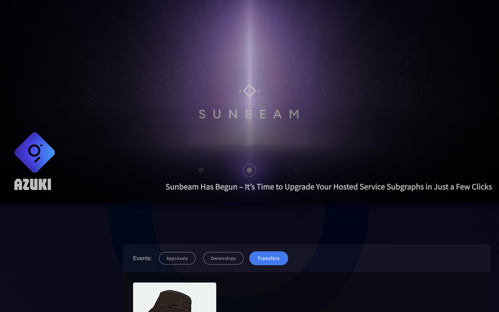
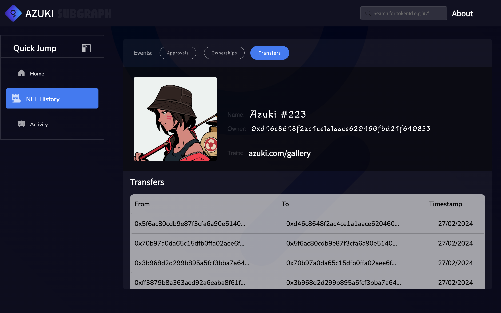
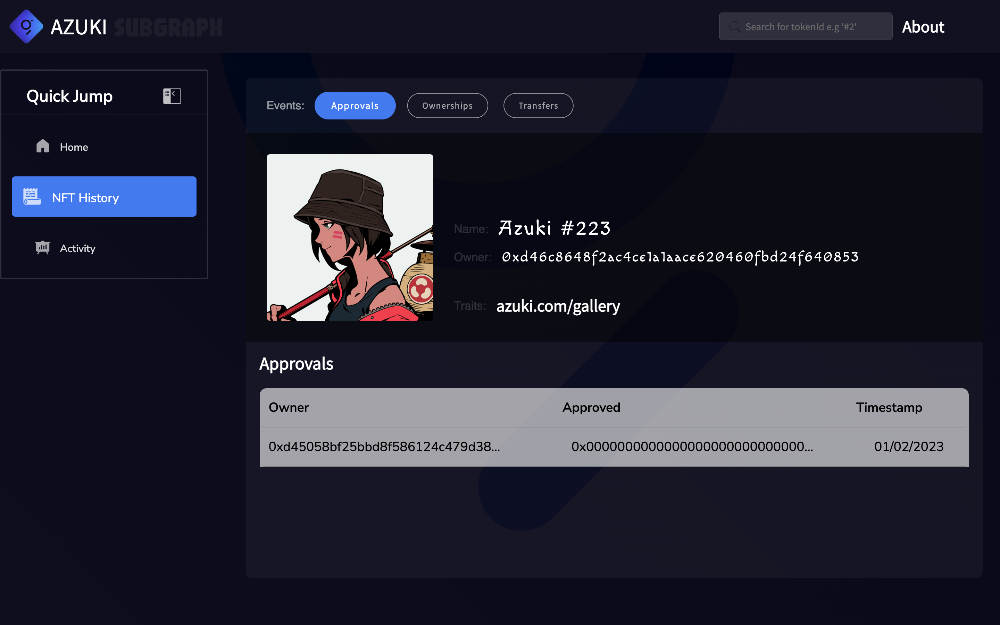
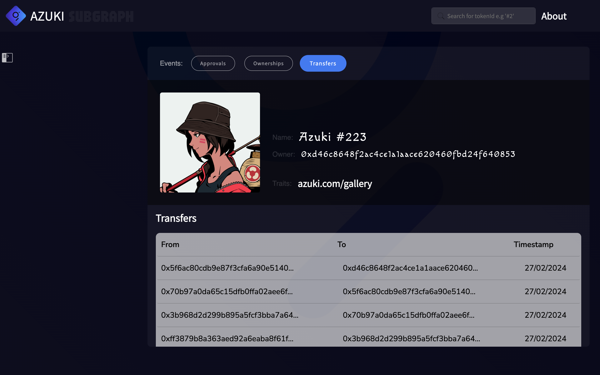
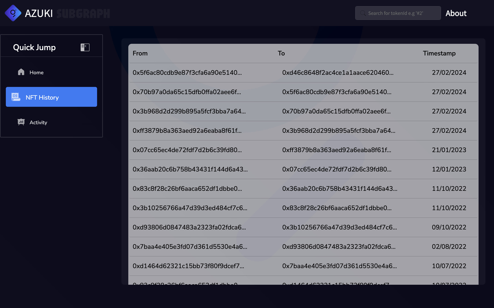
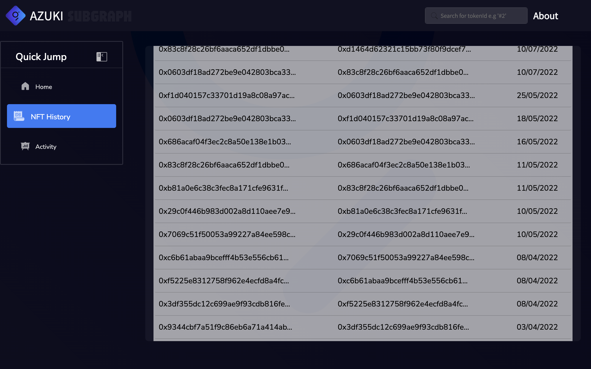

# Sunrise Upgrade Program: First Wave of Missions | AZUKI DApp

## Getting Started

First, run the development server:

```bash
npm run dev
# or
yarn dev
# or
pnpm dev
# or
bun dev
```

Open [http://localhost:3000](http://localhost:3000) with your browser to see the result.

## Inside the app

### Mission

<div align='center'>
    
</div>

<hr/>
<br/>

### Sunbeam

<div align='center'>
    
</div>

<hr/>
<br/>

<div align='center'>
    
    <p>Screenshot One</p>
</div>

<br/>

<div align='center'>
    
    <p>Screenshot Two</p>
</div>

<div align='center'>
    
    <p>Screenshot Three</p>
</div>

<br/>

<div align='center'>
    
    <p>Screenshot Four</p>
</div>

<br/>

<div align='center'>
    
    <p>Screenshot Five</p>
</div>

<br/>

## Live Version

[Vercel App](https://azuki-subgraph-dapp.vercel.app/)
